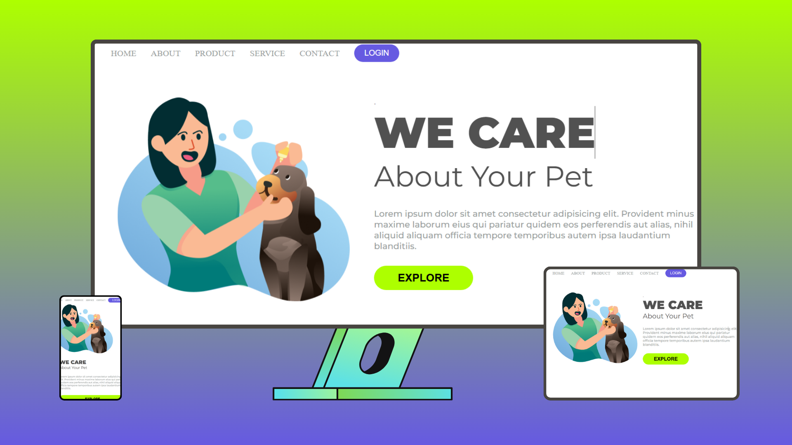

🐾Adote-me 🐾

Um site dedicado à adoção de animais, projetado para oferecer uma experiência visual acolhedora e funcional. Utilizando HTML5 e CSS3, este projeto combina design amigável e navegação intuitiva para ajudar a encontrar um novo lar para nossos amigos peludos.

🔧 Tecnologias Utilizadas:

    🌐 HTML5
   
    🎨 CSS3
   
🌟 Destaques:

    🐶 Design amigável e intuitivo

    📱 Layout responsivo para qualquer dispositivo

    📝 Informações detalhadas sobre cada animal disponível para adoção

